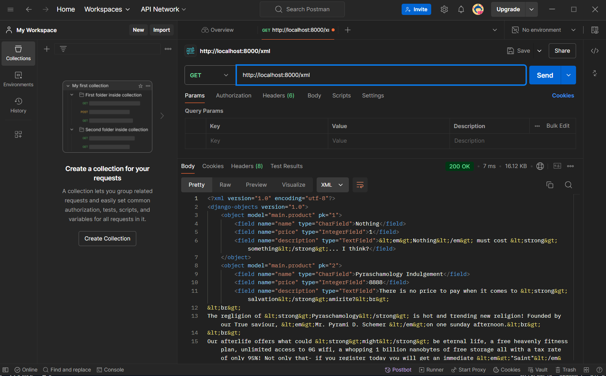
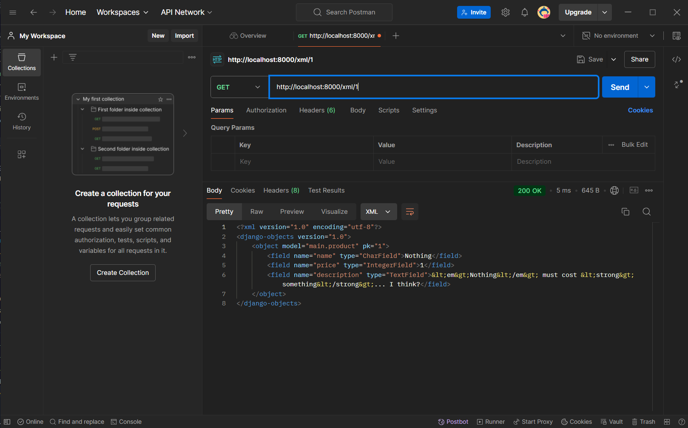
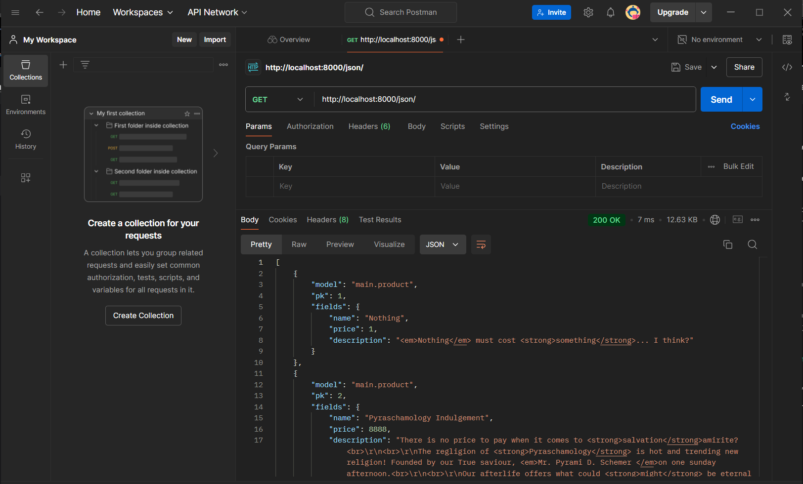
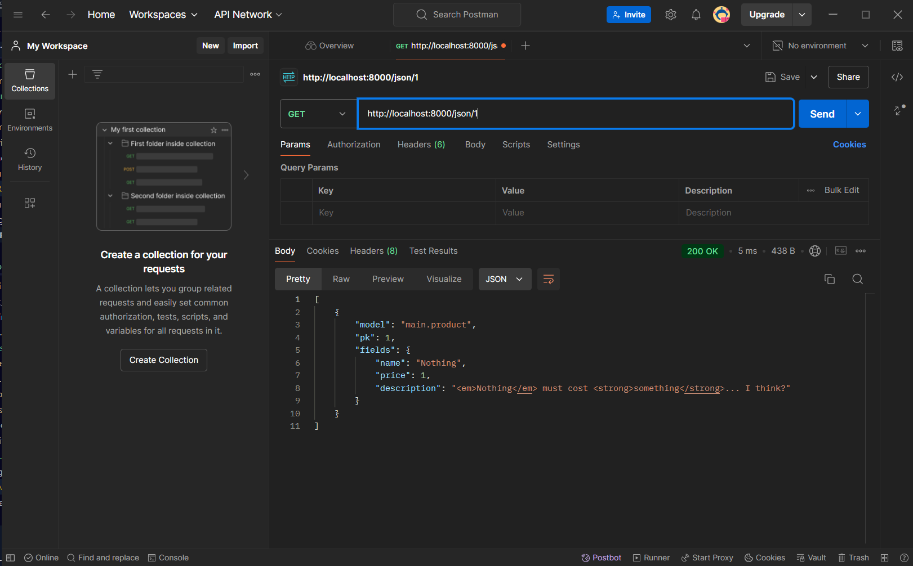

# Checklist Questions

## Tugas 2

Visit website using [this](http:/meinhard-christian-inversepyramidscheme.pbp.cs.ui.ac.id)
Checklist:

- Membuat sebuah proyek Django baru
Buat repo githuhb > +requirements.txt > pip install -r requirements.txt > django-admin startproject inverse_pyramid_scheme > config settings server, .gitignore, etc.

- Membuat aplikasi dengan nama main pada proyek tersebut
python manage.py startapp main.

- Melakukan routing pada proyek agar dapat menjalankan aplikasi main
config settings apps include main.

- Membuat model pada aplikasi main dengan nama Product dan memiliki atribut wajib sebagai berikut: name, price, description
seperti class python biasa tapi inherit dari models.Model

- Membuat sebuah fungsi pada views.py untuk dikembalikan ke dalam sebuah template HTML yang menampilkan nama aplikasi serta nama dan kelas kamu
from django.shortcuts import render
from .models import Product.
buat fungsi view (parameter request), saya namakan show_app
products = Product.objects.all() untuk mendapatkan product dari database sqlite3 (data manual add melalui admin)
context adalah library dengan data yang bisa diakses oleh applikasi .html
return render(request, "main.html", context)

- Membuat sebuah routing pada urls.py aplikasi main untuk memetakan fungsi yang telah dibuat pada views.py.
from main.views import show_app
urlpatterns = [path('', show_app, name='show_app'),]

- Melakukan deployment ke PWS terhadap aplikasi yang sudah dibuat sehingga nantinya dapat diakses oleh teman-temanmu melalui Internet.
Login ke pws > buat new project > add link to project ke allowed host > git push ke pws master (automatically build setiap push) 

- Membuat sebuah README.md yang berisi tautan menuju aplikasi PWS yang sudah di-deploy, serta jawaban dari beberapa pertanyaan berikut.
Menggunakan VSCODE saja

- Jelaskan bagaimana cara kamu mengimplementasikan checklist di atas secara step-by-step (bukan hanya sekadar mengikuti tutorial).
OK

-Buatlah bagan yang berisi request client ke web aplikasi berbasis Django beserta responnya dan jelaskan pada bagan tersebut kaitan antara urls.py, views.py, models.py, dan berkas html.
Di atas saya sudah membuat models > views > urls > html
Kemudian saat client request ke [127.0.0.1:8000](http://127.0.0.1:8000/), selama server jalan webpage akan menampilkan dengan benar
models.py mendefinisikan object apa saja yang dapat dimasukan dan dibaca ke database (harus migrate setiap kali ada perubahan)
berkas html adalah kerangka/skeleton dari applikasi, berisi tata letak text dan data
models dan html disambung oleh view, view membaca data yang direquest dan meng-render request berdasarkan kerangka html yang kemudian di return ke browser client yang menginterpret dan mendisplay applikasi
di antara view dan client, urls.py memetakan view ke dalam URL, request user dikirim melalui URL ini dan menerima respons dari view
Django memiliki server untuk web-aplikasi skala besar yang menjadi intermediary antara URL, user dan view.

-Jelaskan fungsi git dalam pengembangan perangkat lunak!
Mengontrol versi, Membuat programmer lebih akrab dengan mengunnakan commands, remote storage, collaboration (branching, merging, pull request, etc), publikasi program  

-Menurut Anda, dari semua framework yang ada, mengapa framework Django dijadikan permulaan pembelajaran pengembangan perangkat lunak?
Python bahasa paling sederhana, html juga sederhana, perangkat lunak tidak terlalu berat di komputasi jadi python tidak bermasalah, Django menunjukan dan menggunakan bagian back-end (bukan seperti situs yang sudah ada interpreter contohnya) namun banyak hal sudah diotomasikan jadi lebih sederhana.

-Mengapa model pada Django disebut sebagai ORM?
Karena cara Django berinteraksi dengan database dimodelkan seperti OOP. Setiap data dalam databse sql adalah object yang didefinisikan dalam models (dan kemudian di migrate). Jenis object (class model) dipisahkan menjadi tabel berbeda, dan diakses melalui cara berbeda. User dengan administrator privilege dapat membuat, membaca, mengubah dan menghapus data dalam database. Dan filenya encrypted jadi ada lapisan keamanan juga untuk data pribadi.

## Tugas 3

-Jelaskan mengapa kita memerlukan data delivery dalam pengimplementasian sebuah platform? --> Jika semua orang menyimpan data dalam bentuk text atau binary, data menjadi sulit untuk digunakan karena setiap programmer menyimpan data menggunakan format berbeda, untuk itu, proses perubahan data mentah menjadi bentuk/format (serialization format) yang digunakan secara umum (Proses yang disebutkan serialization). Keunggulan dari menggunakan serialization format adalah ada banyak library yang membantu proses serialization, deserialization, encryption dan decryption untuk format serialization yang populer.

-Menurutmu, mana yang lebih baik antara XML dan JSON? Mengapa JSON lebih populer dibandingkan XML? --> Yang mana yang lebih baik tergantung pada jenis data yang ingin disimpan. JSON lebih populer karena lebih human-readable (yang membuatnya mudah untuk diedit secara langsung), tetapi XML memiliki kemampuan penyesuaian/customizability yang lebih tinggi (dengan cara attribut tag daripada key JSON). XML juga lebih efisien jika jenis data yang disimpan lebih rumit.

-Jelaskan fungsi dari method is_valid() pada form Django dan mengapa kita membutuhkan method tersebut? --> POST adalah jenis request yang mengirimkan data ke server, is_valid() adalah metode yang mencari keberadaan error dalam pengisian form (seperti "please fill out this field" atau "This answer is required"), ini memastikan form yang nanti di save() sudah terisi dengan benar.

-Mengapa kita membutuhkan csrf_token saat membuat form di Django? Apa yang dapat terjadi jika kita tidak menambahkan csrf_token pada form Django? Bagaimana hal tersebut dapat dimanfaatkan oleh penyerang? --> csfr (Cross-Site Request Forgery), usatu token yang random-generated tiap sesi dibutuhkan untuk memastikan apakah request yang dikirim oleh suatu user benar-benar adalah request dari user dan bukan dari penyerang, jika form tidak menggunakan token ini, query dari hacker (yang mungkin dari link jahat yang dikirim ke user) tidak bisa dibedakan dengan query benaran dari user jadi server menganggapnya sebagai respons dari user. Hal ini dimanfaatkan oleh penyerang untuk query seperti query transfer uang, query ganti password, atau dalam kasus form ini, mengisi dan submit form user- penyerang dapat memanipulasikan sesi user tanpa mengetahui password/login.

